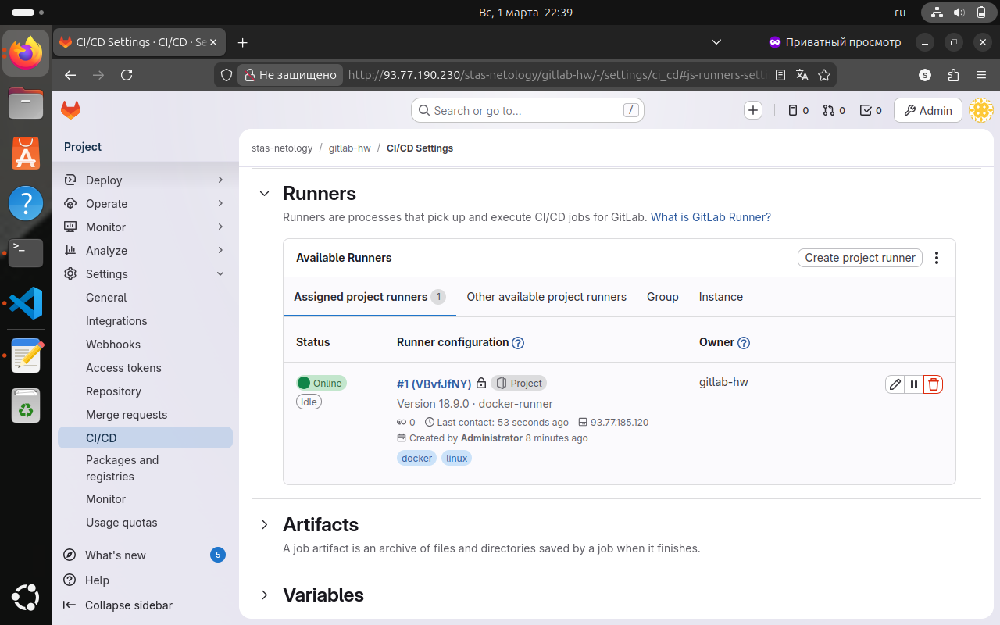
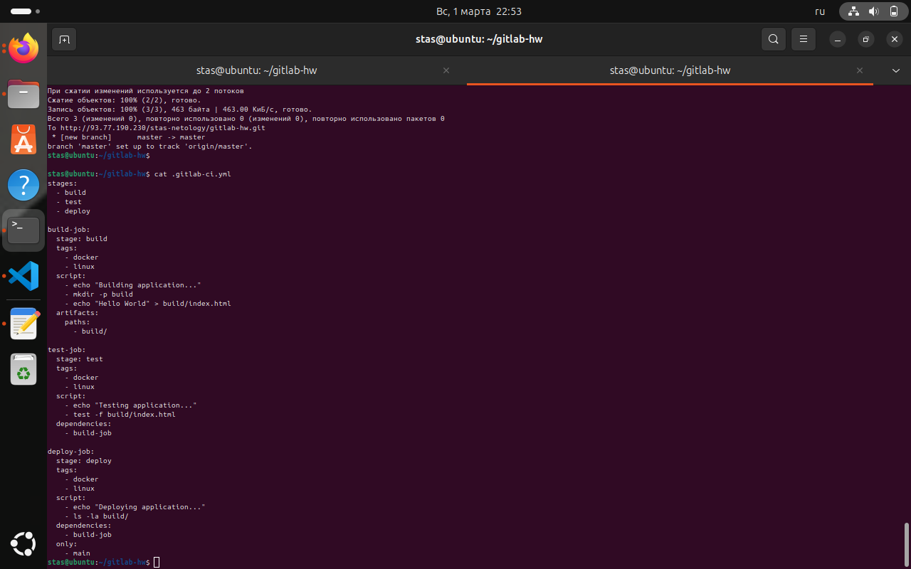
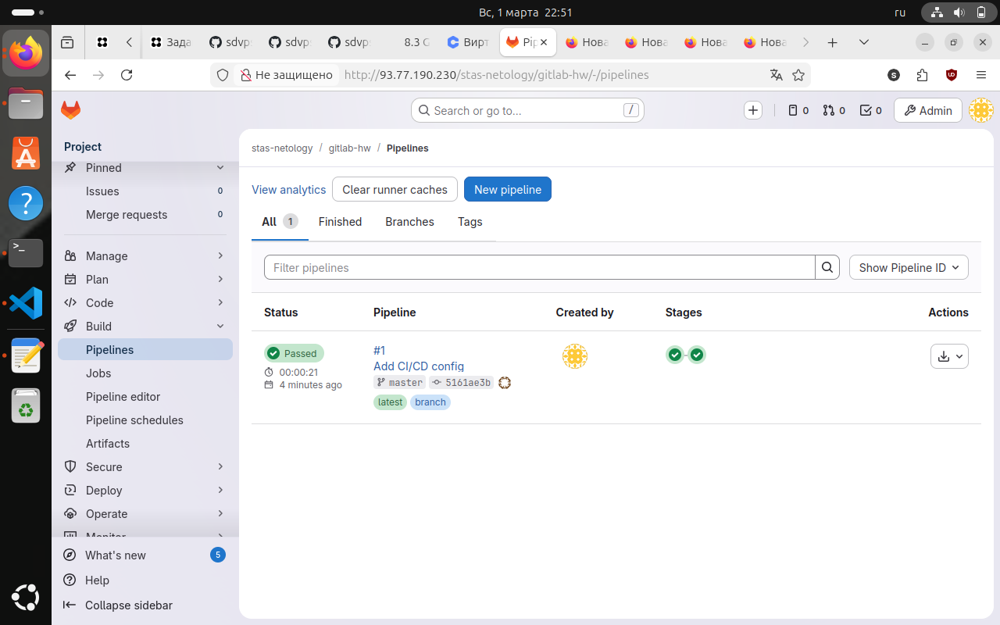

# Домашнее задание: GitLab CI/CD

**Студент:** Лукин Станислав 
**Дата:** 2026-03-01

## Задание 1. Настройки runner в проекте

## Задание 2. CI/CD пайплайн

### Файл .gitlab-ci.yml

### Результат выполнения пайплайна

